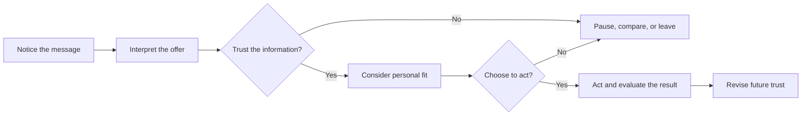

# Chapter 1: Persuasion and Human Decision-Making

Persuasion is the practice of shaping what people notice, how they interpret an option, how much they trust it, and whether they choose to act. It appears in advertising, public information, classroom teaching, political speech, product design, and ordinary conversation.

Persuasion does not create a decision out of nothing. It works with a person's goals, prior knowledge, emotions, social context, and available choices. A designer might use words, images, layout, color, timing, or evidence to make one possibility easier to understand and more appealing. The person being addressed should still be able to think, disagree, and choose.

## Persuasion, Coercion, and Manipulation

These ideas overlap, but they are not interchangeable:

| Approach | How it works | What happens to choice? | Example |
| --- | --- | --- | --- |
| Persuasion | Gives reasons, frames meaning, and invites a decision | Choice remains open and important information is not deliberately hidden | A T-shirt page explains the fabric, price, and care instructions, then shows why the shirt may suit a buyer's needs |
| Coercion | Uses force, threats, or punishment | The person acts to avoid a serious consequence | Someone is told to buy a product or lose access to something they depend on |
| Manipulation | Exploits confusion, pressure, hidden information, or a vulnerability | Choice may technically exist but is engineered to be uninformed or difficult to refuse | A checkout hides a recurring charge in small text and makes cancellation hard to find |

Persuasion becomes ethically weak when it starts borrowing the methods of coercion or manipulation. A persuasive message can be vivid and emotionally engaging without being deceptive. The useful test is not simply, “Did the audience say yes?” Ask instead, “Could a reasonable person understand what is being asked, check the important claims, and decline without unfair punishment?”

## The Plain White T-Shirt

Consider one plain white T-shirt. The shirt itself does not change, but its presentation can invite different interpretations:

- **Practical:** “A durable white layer for everyday wear.” A clear photo, size chart, fabric details, and care instructions reduce uncertainty.
- **Minimalist:** “One clean shape, designed to stay in rotation.” Quiet typography and generous space frame the shirt as a deliberate choice.
- **Community-focused:** “A reliable blank for a student organization.” A group photo and a simple order process make belonging part of the offer.
- **Urgent:** “Order by Friday for the event.” A real deadline can help a buyer coordinate, but inventing a countdown would be deceptive.

The physical product remains the same. Persuasion changes the attention and meaning around it. That power is exactly why designers need to be honest about what they are doing.

## Cialdini's Principles of Influence

Robert Cialdini's research and writing popularized several recurring principles that can affect compliance and decision-making. They describe tendencies, not automatic laws. People can resist them, and a principle is not evidence that an offer is good.

1. **Reciprocity:** People often feel an obligation to return a benefit. A useful, no-strings-attached sizing guide can build goodwill; calling a tiny sample a “gift” and then pressuring a purchase abuses that feeling.
2. **Commitment and consistency:** After making a public or meaningful commitment, people often prefer actions that fit it. A buyer might choose a repairable shirt after supporting a repair pledge; a designer should not use a trivial click to disguise a much larger commitment.
3. **Social proof:** When uncertain, people look to what similar others appear to do. Genuine reviews from identifiable customers can help; fabricated reviews or inflated popularity numbers mislead.
4. **Liking:** People are more receptive to people or organizations they like, recognize, or feel similar to. A relatable maker story can create connection; using an artificial friendship or targeting insecurity is exploitative.
5. **Authority:** Expertise, credentials, or relevant experience can make information more credible. A textile specialist can explain fiber properties; an unrelated celebrity should not be presented as a technical expert.
6. **Scarcity:** Limited availability can increase perceived value and encourage timely action. A genuinely small production run may be described accurately; fake low-stock warnings manufacture pressure.
7. **Unity:** People may respond strongly to a shared identity or sense of “we.” A student group can use its real community purpose to invite participation; a brand should not claim an identity it does not respect or serve.

These principles are most responsible when they clarify a real benefit or a real condition. They become risky when the design makes an audience feel obligated, confused, ashamed, or afraid before it can evaluate the choice.

## Three More Useful Concepts

### Framing

Framing means selecting and organizing details so that an audience sees an issue from a particular angle. “A $20 shirt” emphasizes price, while “a shirt worn 100 times” emphasizes cost per use. Neither frame is automatically false, but each leaves other questions open. A fair frame should not hide facts that would reasonably change the decision.

### Choice Architecture

Choice architecture is the design of how options are arranged: defaults, order, labels, timing, and the number of steps required. Putting a clear size guide beside the purchase button helps people act on useful information. Preselecting an unwanted subscription and burying the opt-out also shapes behavior, but it does so by taking advantage of inattention.

### Elaboration Likelihood

People do not process every message with the same amount of effort. When a decision matters and someone has time and motivation, they may examine evidence closely. When attention is limited, they may rely more on cues such as familiarity, visual quality, or a trusted source. A T-shirt page should therefore offer both quick orientation and accessible detail: a clear main image for scanning, plus fabric composition, measurements, price, and return terms for careful evaluation.

## Principle, Mechanism, and Risk

The table below connects common influence principles to responsible design choices. “Ethical use” does not mean guaranteed success; it means the influence is grounded in truthful, relevant information and leaves room for refusal.

| Principle | Mechanism | Ethical use | Misuse risk |
| --- | --- | --- | --- |
| Reciprocity | A benefit creates a feeling of obligation | Offer a genuinely useful guide without requiring a purchase | Gifts or free content become pressure disguised as debt |
| Commitment and consistency | People align later actions with earlier commitments | Let someone save preferences or set a goal they can revise | A small click quietly commits someone to an expensive plan |
| Social proof | Others' behavior reduces uncertainty | Show real, relevant reviews with context | Fake reviews, copied testimonials, or misleading counts |
| Liking | Affection and similarity increase receptiveness | Use a sincere, relevant voice and recognizable people | Flattery, false intimacy, or targeting loneliness |
| Authority | Expertise serves as a shortcut for credibility | Identify qualified sources and explain their relevance | Borrowed status or celebrity endorsement implies expertise that is absent |
| Scarcity | Limited availability increases attention and perceived value | State a real stock limit or deadline clearly | Fake countdowns, false “last chance” claims, or endless relaunches |
| Unity | Shared identity creates belonging and cooperation | Invite a real community to participate in a way that benefits it | Pretending to represent a group while extracting from it |
| Framing | Selected emphasis changes interpretation | Present benefits alongside material limitations and costs | Omitting inconvenient facts or exploiting a misleading comparison |
| Choice architecture | Arrangement changes what is easy or salient | Make the informed, reversible option easy to choose | Dark patterns, confusing defaults, or obstructed cancellation |

## A Simple Decision Journey

Persuasion often works as a sequence rather than a single moment. Good design supports each step instead of trying to skip straight to action.

For the white T-shirt, a strong page might first make the shirt easy to notice, then explain its fit and material, show a real customer review, and provide a reversible purchase decision with clear return information. The goal is not to eliminate reflection. It is to make reflection possible.

## Ethical Cautions

- **Tell the truth.** Do not imply a feature, discount, endorsement, deadline, or limitation that is not real.
- **Respect attention.** Do not use endless pop-ups, alarming interruptions, or confusing repetition to wear someone down.
- **Protect vulnerable audiences.** Children, people in crisis, and people with limited language, financial, or technical resources may need stronger safeguards.
- **Make important terms visible.** Price, recurring charges, data collection, eligibility rules, and cancellation steps should not be hidden in a less noticeable layer.
- **Support informed refusal.** A person should be able to say no, leave, compare alternatives, or change their mind without humiliation or unreasonable friction.
- **Check the outcome, not only the conversion rate.** A successful click can still produce regret, unnecessary spending, or loss of trust.

## Questions to Ask Before Trying to Persuade

1. What decision am I asking someone to make, and who benefits from it?
2. What does the audience need to know to make an informed choice?
3. Which facts am I emphasizing, and which relevant facts might my frame hide?
4. Am I using evidence, or am I mainly using pressure, fear, shame, or confusion?
5. Are any claims about popularity, expertise, scarcity, savings, or community identity verifiable?
6. Can the person decline, compare, cancel, or change their mind easily?
7. Could this design unfairly affect someone with less money, time, access, or experience?
8. What would happen if the audience saw the persuasive strategy clearly?
9. How will I learn whether the result helped people rather than merely increasing clicks?

## Explore Further

For further study, search for:

- Robert Cialdini's principles of influence and the distinction between ethical influence and exploitation
- framing effects and prospect theory in behavioral economics
- choice architecture and dark patterns in user experience design
- the elaboration likelihood model in persuasion research
- informed consent and ethical communication in design

Use reliable academic, professional, or institutional sources, and compare explanations rather than accepting a single summary uncritically.

## What You Should Remember

Persuasion shapes attention, interpretation, trust, and action, but it should not remove meaningful choice. Cialdini's principles, framing, and choice architecture can help designers communicate clearly or pressure people unfairly. The same white T-shirt can carry different meanings through presentation, yet ethical design keeps the product facts visible, respects refusal, and measures whether people are genuinely better informed.