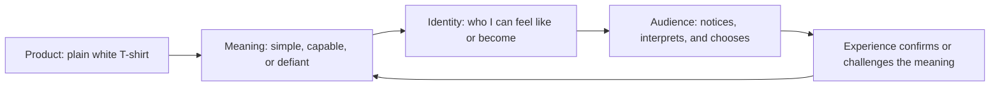

# Chapter 2: Brand Archetypes and Meaning

A product is never experienced as its materials alone. People also notice what it seems to stand for, who appears to use it, and what kind of person they might become by choosing it. Brand archetypes are a practical framework for shaping that layer of meaning.

An archetype is a recognizable cultural and narrative pattern. It gives an organization, product, or experience a familiar role: the guide, the rule-breaker, the maker, the protector, or the adventurer. The framework helps a team make consistent choices about language, visuals, behavior, and customer experience.

The most useful question is:

> What does the audience get to feel, imagine, or become by choosing this brand?

Archetypes are not magic labels that make a product meaningful by themselves. A brand has to express its chosen pattern through real actions and evidence. A brand that presents itself as a Caregiver but makes support difficult creates a contradiction that an attractive logo cannot solve.

## A Working Set of Archetypes

The following set is a useful starting vocabulary. The descriptions are tendencies, not formulas.

| Archetype | Core desire | Typical audience feeling | Common signals |
| --- | --- | --- | --- |
| Explorer | Freedom, discovery, and possibility | “I can go beyond the familiar” | Open spaces, journeys, tools, flexible choices |
| Sage | Understanding and truth | “I can make a well-informed decision” | Evidence, explanation, calm authority |
| Creator | Making something original | “I can bring an idea into the world” | Process, craft, experimentation, distinctive form |
| Ruler | Order, responsibility, and control | “I can lead or manage well” | Structure, standards, polish, dependable systems |
| Caregiver | Protection and support | “I am looked after, and I can look after others” | Warmth, accessibility, helpful guidance |
| Rebel | Freedom from an unfair or stale norm | “I can challenge what does not work” | Contrast, direct language, unconventional choices |
| Hero | Courage, effort, and achievement | “I can face a difficult task” | Progress, training, resilience, clear goals |
| Everyperson | Belonging and ordinary connection | “There is a place for someone like me” | Familiar language, shared routines, approachability |
| Innocent | Safety, optimism, and simplicity | “Things can feel clear and good” | Lightness, openness, uncomplicated experiences |
| Jester | Play, surprise, and release | “I can enjoy this and not take everything so seriously” | Humor, wit, unexpected combinations |
| Lover | Connection, pleasure, and appreciation | “This helps me value or express what I love” | Sensory detail, intimacy, beauty, attention |
| Magician | Transformation and new possibility | “A different outcome may be possible” | Before-and-after stories, wonder, reframing |

These patterns often overlap. A health organization might combine Caregiver and Sage. A software tool might combine Creator and Explorer. The combination should clarify the experience rather than become a pile of unrelated adjectives.

## The Same Shirt, Different Meaning

Imagine that the physical product is always the same: one plain white T-shirt. The cotton, cut, and stitching do not change. What changes is the story and the experience built around it.

### The Explorer Shirt

The shirt is photographed in changing locations and described as a dependable base for travel, layering, and improvisation. The message is not that the shirt will create adventure by itself. It is that its simplicity leaves room for movement and personal choice.

The audience may feel ready, capable, and unconfined. They imagine packing lightly, adapting to weather, and making one familiar item work in several settings. The product becomes a tool for freedom.

### The Sage Shirt

The same shirt is presented with close-up material details, measurements, washing guidance, and a transparent explanation of how it is made. The design is restrained because the focus is on understanding the choice.

The audience may feel informed and in control. They imagine choosing carefully rather than chasing a trend. Here, the white shirt means clarity and considered judgment.

### The Rebel Shirt

The same shirt is placed in a deliberately challenging context: perhaps the copy questions overcomplicated fashion and invites people to reject needless status signals. The visual system uses strong contrast and direct language, while the product details remain accurate.

The audience may feel independent and willing to resist pressure. They imagine refusing the idea that every season requires a new identity. The plainness of the shirt becomes a statement against excess.

### The Caregiver Shirt

The shirt is framed as an easy, reliable choice for a shared household or community order. The page gives extra attention to fit guidance, accessible language, durable care instructions, and a straightforward return process.

The audience may feel supported and able to support others. The shirt means dependable usefulness rather than personal status.

The product is identical in all four versions. The meaning changes because the surrounding choices answer different needs: freedom, understanding, resistance, or care. This is the practical value of an archetype. It helps a team make many small decisions point in the same direction.

## From Product to Identity

An archetype should connect the concrete product to an audience's self-understanding. The sequence below is not a guarantee of what people will feel; it is a design question to test with evidence and feedback.

For example, the Explorer version may move from “plain shirt” to “flexible tool,” then to “I am prepared for discovery.” The Sage version may move from “plain shirt” to “understood choice,” then to “I am careful and informed.” The identity step matters because audiences are not just buying objects; they are often selecting signals, habits, affiliations, or possibilities for themselves.

## Archetypes Are Not Destiny

Archetypes are models, not literal personality diagnoses. They do not prove that a customer is an Explorer or that an employee is a Sage. They are interpretive tools for noticing patterns in a brand's behavior and for making intentional creative decisions.

Several cautions follow:

- **People contain multiple tendencies.** Someone may want adventure in one part of life, reliable care in another, and playful expression somewhere else.
- **Brands can combine roles.** A serious service can be both Sage and Caregiver, as long as the combination is understandable in practice.
- **Context changes meaning.** White clothing may suggest cleanliness, simplicity, ceremony, labor, or blank potential depending on the setting and the audience. No symbol has exactly one universal meaning.
- **Culture matters.** Colors, humor, status signals, family roles, and ideas about independence vary across communities. A team should research and listen rather than assume that its preferred interpretation is shared.
- **Archetypes can stereotype.** Reducing an audience to one identity may exclude people or turn cultural patterns into caricature.
- **Behavior must support the story.** If a brand says “Caregiver” but hides fees, ignores accessibility, or makes support unreachable, the archetype exposes a promise the organization is not keeping.

Use archetypes to generate and test hypotheses: “This audience might value the shirt as a symbol of freedom.” Then look for evidence in interviews, observation, usability testing, sales patterns, and customer feedback. Do not use the label as a substitute for learning from people.

## Choosing and Expressing an Archetype

Once a team has a possible archetype, translate it into observable decisions:

| Design decision | Explorer version | Sage version | Rebel version |
| --- | --- | --- | --- |
| Main promise | Ready for changing situations | Clear information for a considered choice | A simple alternative to excess |
| Image direction | Movement, distance, adaptation | Detail, process, evidence | Contrast, interruption, challenge |
| Voice | Open, active, possibility-focused | Precise, explanatory, measured | Direct, questioning, energetic |
| Customer experience | Flexible options and practical packing help | Comparisons, specifications, and transparent terms | A clear critique paired with an honest alternative |
| Risk to watch | Making adventure sound guaranteed | Sounding cold or superior | Mistaking hostility for independence |

The table makes the archetype operational. It turns a mood into choices that can be reviewed. A team can ask whether its product page, packaging, service, and after-purchase behavior all support the same meaning.

## Questions to Ask When Choosing an Archetype

1. What does the audience get to feel, imagine, or become by choosing this brand?
2. What real product quality or organizational behavior supports that promise?
3. Which archetype best explains what we consistently do, not merely how we want to look?
4. Are we choosing one primary pattern, or combining two patterns that genuinely belong together?
5. What other meanings might this symbol, tone, color, or story have for this audience?
6. Could our framing stereotype, exclude, or pressure people to perform an identity?
7. How might different cultural communities interpret this archetype differently?
8. What would the plain white T-shirt look, sound, and feel like if we removed the archetype language?
9. What evidence would show that people recognize the intended meaning without being told what to think?
10. Can the organization keep this promise after the purchase, during support, and when something goes wrong?

## What You Should Remember

Brand archetypes are practical patterns for giving a product or organization recognizable meaning. They help connect a product to a feeling, an imagined identity, and an audience, but they are not rigid personality types or universal truths. The same plain white T-shirt can become an Explorer's flexible tool, a Sage's considered choice, a Rebel's refusal of excess, or a Caregiver's dependable basic. The strongest archetype is the one supported by real behavior, cultural awareness, and a clear benefit for the people being addressed.