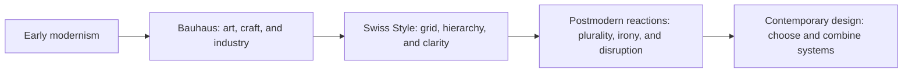

# Chapter 3: Design Language and Visual Ideas

Visual design is not decoration added after an idea. The choices of type, space, image, color, alignment, material, and interaction tell people how to read a message and what kind of world it belongs to. A strict grid can suggest reliability. A crowded composition can suggest energy or conflict. A familiar symbol can create recognition, while an unusual one can create curiosity.

This does not mean that visual elements have one permanent meaning. Meaning depends on context, history, audience, and use. It is more helpful to think of design as a language with patterns and conventions than as a universal dictionary.

## A Short History of Modernist Design

Early modernist designers responded to industrial production, new technologies, urban life, and changing social conditions. Across different movements, many sought a visual language suited to modern life rather than one based mainly on historical ornament. They explored abstraction, geometric form, photography, new relationships between text and image, and the idea that design should serve a purpose.

The **Bauhaus**, founded in Germany in 1919, brought together art, craft, and industrial design in an influential educational experiment. Its workshops and teaching emphasized materials, making, experimentation, and the relationship between form and use. It was not one single look, but its legacy is often associated with geometric structure, functional thinking, and an interest in design for modern production.

The **Swiss Style**, also called the **International Typographic Style**, developed especially in the mid-twentieth century. It is associated with structured grids, sans-serif type, asymmetrical composition, photography, and clear hierarchy. Designers using this approach often tried to make information legible and organized rather than expressive through decoration. The grid provided a system for placing elements consistently, while whitespace and scale helped readers navigate.

Modernism made important contributions: it helped designers handle complex information, build coherent systems, and connect form to function. But its language could also appear to claim more universality and neutrality than any design can truly possess. Every grid, typeface, image, and omission reflects choices made by people in a particular culture and institution.

## Postmodernism and the Return of Difference

Postmodern design developed partly as a reaction against modernist certainty, restraint, universality, and order. Designers questioned whether clarity always needed to look neutral, whether a grid should control every element, and whether a single rational system could represent every audience. They made room for quotation, historical references, irony, ornament, fragmentation, expressive typography, and competing voices.

Postmodernism is not simply “messy design.” A disrupted layout can be carefully constructed, and a playful reference can communicate serious criticism. The point is that design may acknowledge its own conventions, mix styles, and allow ambiguity instead of pretending to be invisible or universal.

The modernist and postmodern positions are best understood as a continuing tension:

- **Order and disruption:** Does the layout guide the eye smoothly, or interrupt the expected path?
- **Universality and identity:** Does the system aim to work broadly, or foreground a particular community, history, or point of view?
- **Clarity and expression:** Is the priority quick comprehension, or a distinctive emotional and cultural voice?
- **Grid and anti-grid:** Are relationships controlled by a repeatable structure, or does the composition deliberately resist it?
- **Restraint and abundance:** Does reduction create focus, or does abundance communicate richness, plurality, or excess?
- **Function and irony:** Is the design helping an object work, commenting on how objects work, or doing both at once?

These are not switches with only two settings. A designer can use a grid and break it at one important moment. A product can be easy to use while also expressing a strong identity. A clear interface can include humor without making a serious task confusing.

## Design Tensions in Contemporary Digital Products

The history continues in websites, apps, dashboards, packaging, and services. A banking interface may use a restrained grid, consistent controls, and clear hierarchy because users need to find information quickly. A music or culture site may use oversized type, animation, layering, and unexpected transitions to signal energy and a particular point of view. A product team might use both: an expressive landing page and a highly ordered checkout.

Digital design also makes the tensions practical. An anti-grid layout can be memorable, but it may become inaccessible if reading order, contrast, or responsive behavior is unclear. A universal design system can improve consistency, but it can feel generic if it leaves no room for local language, cultural identity, or different needs. The question is not whether modernism or postmodernism wins. The question is which visual decisions help this audience complete this task and understand this point of view.

## Comparing Visual Languages

| Tension | Modernist tendency | Postmodern response | Contemporary design question |
| --- | --- | --- | --- |
| Order and disruption | Establish a predictable visual system | Interrupt or expose the system | Where should the user feel guided, and where should they notice a change? |
| Universality and identity | Seek broadly legible conventions | Highlight situated voices and references | Who is represented, and who might find the system unfamiliar? |
| Clarity and expression | Reduce distraction to improve comprehension | Use style, ambiguity, or emotion as meaning | What must be understood immediately, and what can invite interpretation? |
| Grid and anti-grid | Align elements through repeatable structure | Overlap, offset, or resist alignment | Does the composition remain usable at different screen sizes? |
| Restraint and abundance | Use limited elements and generous space | Layer references, textures, and visual intensity | Is the amount of information focused, rich, or simply overwhelming? |
| Function and irony | Make form support use directly | Comment on conventions or expectations | Can the joke or critique coexist with a usable experience? |

## The Plain White T-Shirt in Two Visual Languages

The physical product is still one plain white T-shirt. A **modernist presentation** might place it against a plain background with a precise grid, restrained typography, a measured product photograph, and a clear list of fabric, size, price, and care information. The shirt could feel universal, efficient, durable, and carefully considered. The presentation says that the object can be understood through its essential qualities.

A **postmodern presentation** might combine the same product photograph with oversized type, a deliberately awkward crop, a historical fashion reference, contrasting textures, or an ironic caption. The design could question the idea that a “basic” shirt is neutral, or make the gap between ordinary object and cultural meaning visible. The shirt might feel self-aware, expressive, or critical of fashion conventions.

Neither presentation changes the cotton or cut. Each creates a different reading path and relationship to the audience. The modernist version emphasizes order and information; the postmodern version emphasizes context, quotation, and interpretation. Both still need truthful product details and a usable way to buy the shirt.

## How to Read a Design

When you encounter a poster, website, package, or object, move from observation to interpretation rather than jumping straight to “I like it” or “I dislike it.” Ask:

1. **What do I notice first?** Look at scale, contrast, color, image placement, motion, and the first words or controls that attract attention.
2. **How is my eye being guided?** Trace alignment, whitespace, repetition, hierarchy, reading order, and visual obstacles.
3. **What kind of voice does this use?** Is it formal, intimate, playful, technical, urgent, local, institutional, or deliberately ambiguous?
4. **What design system is implied?** Look for a grid, repeated components, type families, rules, patterns, or intentional rule-breaking.
5. **What history or culture does it reference?** Notice quotations, materials, symbols, conventions, and whose perspective appears to be centered.
6. **What is the design asking me to do?** Read, buy, trust, identify, remember, navigate, participate, or question?
7. **Who might read it differently?** Consider language, disability, cultural experience, technical access, and familiarity with the references.
8. **Do form and function support each other?** A striking design can still fail if important information is hidden or an interaction is hard to complete.

Keep evidence separate from interpretation. “The title is larger than the body text” is an observation. “The design wants the title to feel authoritative” is an interpretation that should be tested against the rest of the composition.

## Museum Research

Historical examples are easiest to learn from when you look at authentic objects, images, and records rather than relying only on a style summary. Search the online collections, collection databases, exhibition records, or research pages of credible institutions such as The Metropolitan Museum of Art, MoMA, Cooper Hewitt, the V&A, Bauhaus archives, or other museums and institutional collections.

Use search terms such as:

- `Bauhaus typography poster collection`
- `Bauhaus industrial design object collection`
- `International Typographic Style grid poster`
- `Swiss Style graphic design typography`
- `modernist graphic design photography sans serif`
- `postmodern graphic design expressive typography`
- `postmodern graphic design grid disruption`

Search within the institution's own collection or research pages, and verify each actual object yourself. Record the object's title, maker or designer when listed, date, medium, institution, and the page where you found it. Do not assume that a search-result image is an authentic example, and do not treat an object as proof of a whole movement without looking at its context.

For a small comparison exercise, select one modernist example and one postmodern example from credible collections. Describe what you can directly observe before explaining how each handles order, identity, clarity, expression, grid, restraint, function, or irony. The goal is not to rank the objects. It is to practice seeing how visual decisions carry ideas.

## What You Should Remember

Visual design carries ideas through systems of type, space, image, material, alignment, and interaction. Modernism contributed powerful tools for order, hierarchy, clarity, grids, reduction, and function; postmodernism challenged claims of neutrality and made room for disruption, identity, quotation, abundance, and irony. Contemporary design keeps negotiating these tensions. The same white T-shirt can feel universal and efficient or expressive and self-aware depending on its presentation, but every visual language still has to serve real people and real use.