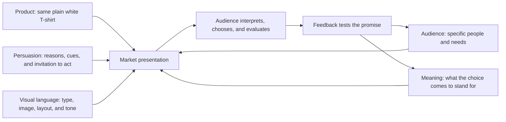

# Chapter 4: One Shirt, Four Worlds

Here is the product: an ordinary, high-quality plain white T-shirt. It has a comfortable fit, clear care instructions, and a price that can be stated honestly. Nothing about the physical shirt will change in the concepts that follow.

What changes is the market presentation. The same object can become equipment, a design classic, a cultural provocation, or a dependable act of care. This is not a trick that turns an average product into four different products. It is a demonstration of how audience, meaning, persuasion, and visual language work together.

## The Brief

Our imaginary team knows the shirt's material and construction, but it has not yet decided what the shirt should mean. That decision cannot be made by choosing a color palette at the very end. It begins with a specific audience and a believable promise.

The four concepts below are deliberately exaggerated so the differences are easy to see. In real work, a brand might combine elements, but it should know which meaning leads.

## Concept One: The Open Road Basic

**Audience:** People who want a simple, flexible layer for travel, outdoor weekends, and changing daily conditions.

**Chosen brand archetype:** Explorer.

**Persuasion principles being used:** Social proof through real packing and use stories; authority through accurate information about fit and care; commitment and consistency by framing the shirt as part of a repeatable, lighter-packing habit.

**Visual-design language:** Spacious photography, directional lines, maps used only when relevant, practical sans-serif type, and a restrained palette that lets the shirt remain visible. The layout feels like a field guide rather than a luxury catalog.

**Headline:** “One shirt. More places to wear it.”

**Short product story:** The shirt is a dependable base for a day that changes shape. It can be worn alone, layered, washed according to its care instructions, and packed without demanding much attention. The story celebrates flexibility without claiming that a T-shirt creates adventure.

**Imagery direction:** Show the same shirt in several ordinary settings: a train platform, a shared kitchen, a day walk, and a cool evening under a jacket. Keep the images concrete rather than turning travel into an empty lifestyle fantasy.

**What meaning is the customer invited to buy?** The customer is invited to buy readiness and freedom from overplanning. The shirt becomes a tool that leaves room for the person wearing it.

**Ethical concern or possible misuse:** Travel imagery can imply that buying a product makes someone adventurous or socially interesting. The campaign should avoid promising transformation, avoid glamorizing inaccessible lifestyles, and make the shirt's actual limits clear.

## Concept Two: The Measured Essential

**Audience:** Buyers who compare materials, measurements, price, and care before choosing a basic garment.

**Chosen brand archetype:** Sage, with a secondary Creator tendency shown through attention to construction.

**Persuasion principles being used:** Authority through relevant product information; framing by presenting the shirt as a long-term wardrobe decision rather than an impulse; choice architecture through an easy-to-scan size guide and visible return terms.

**Visual-design language:** Restrained modernist and Swiss-influenced design: a disciplined grid, asymmetrical but calm alignment, sans-serif type, generous whitespace, a limited palette, and a strong hierarchy. The page puts fabric composition, measurements, price, and care near the product image.

**Headline:** “The basic, clearly explained.”

**Short product story:** A plain shirt does not need a dramatic backstory to deserve attention. The page explains what the customer can inspect, what the shirt is designed to do, and what the customer should not expect. Its confidence comes from making comparison possible.

**Imagery direction:** Use a direct product photograph, close-ups of seams and fabric texture, a consistent fit reference, and diagrams or measurements that are readable without becoming decorative noise.

**What meaning is the customer invited to buy?** The customer is invited to buy clarity and considered judgment. The shirt becomes evidence that an ordinary purchase can be deliberate.

**Ethical concern or possible misuse:** A clean grid and technical vocabulary can make weak evidence look authoritative. The team must not hide uncertain sourcing, exaggerate durability, or imply that minimal design equals superior quality.

## Concept Three: Basic Is a Costume

**Audience:** People interested in fashion, media, and the cultural assumptions hidden inside ordinary objects.

**Chosen brand archetype:** Rebel, with a Jester-like willingness to play with conventions.

**Persuasion principles being used:** Liking through humor and recognition; framing by questioning the idea that “basic” is neutral; unity by inviting an audience to notice and discuss a shared cultural habit.

**Visual-design language:** Disruptive and postmodern: oversized type, abrupt scale changes, deliberate cropping, layered references, visual quotation, and a layout that interrupts the clean product page. The design can be surprising, but price, fit, and care information remain easy to find.

**Headline:** “Nothing to see here. Look again.”

**Short product story:** The shirt is ordinary on purpose. It can signal simplicity, conformity, cleanliness, work, leisure, or a blank surface depending on where it appears and who is reading it. The presentation refuses to pretend that “plain” means free of cultural meaning.

**Imagery direction:** Pair straightforward shirt photographs with unexpected captions, close crops, photocopy-like textures, and contrasting references to uniforms, basics, and fashion imagery. The visual joke should point toward an idea rather than mock the audience.

**What meaning is the customer invited to buy?** The customer is invited to buy self-awareness and the pleasure of seeing a familiar object differently. The shirt becomes a small prop in a larger question about taste and identity.

**Ethical concern or possible misuse:** Irony can become exclusionary if only an insider understands it. Provocation should not obscure product facts, borrow cultural references carelessly, or treat criticism as a substitute for a useful garment.

## Concept Four: The Shared Basic

**Audience:** Families, student groups, mutual-aid organizers, and anyone looking for an approachable shirt that can work across a shared activity.

**Chosen brand archetype:** Caregiver, with Everyperson as a supporting archetype.

**Persuasion principles being used:** Reciprocity through genuinely useful fit and care guidance; social proof through real group feedback; unity by emphasizing shared use without claiming that everyone has the same needs.

**Visual-design language:** Warm, accessible, and conversational. Use readable type, inclusive photography, clear contrast, plain-language labels, and a calm order that makes group ordering less stressful. The design is welcoming rather than sentimental.

**Headline:** “A reliable layer for everyone in the room.”

**Short product story:** A good basic can reduce one small source of difficulty. The page answers practical questions, offers a clear size process, explains returns, and helps a group order without turning belonging into a performance. The shirt is useful because it does its job and because the experience respects people's time.

**Imagery direction:** Show several people with different bodies, ages, and styles wearing the same white shirt in a classroom, shared workspace, or community event. Include fit information and alternative ways to wear it, not just a single idealized pose.

**What meaning is the customer invited to buy?** The customer is invited to buy dependability, welcome, and the ability to participate without having to decode a complicated style system.

**Ethical concern or possible misuse:** “For everyone” can become an empty claim if the sizing, price, accessibility, or return process excludes people. The team should test the experience with the communities it addresses and fix practical barriers rather than relying on warm language.

## Synthesis Table

| Concept | Audience | Archetype | Persuasion focus | Visual language | Meaning invited |
| --- | --- | --- | --- | --- | --- |
| The Open Road Basic | Flexible travelers and outdoor users | Explorer | Social proof, authority, commitment | Spacious field-guide system | Readiness and freedom |
| The Measured Essential | Careful, comparison-oriented buyers | Sage / Creator | Authority, framing, choice architecture | Restrained modernist / Swiss-influenced grid | Clarity and considered judgment |
| Basic Is a Costume | Fashion and culture audiences | Rebel / Jester | Liking, framing, unity | Disruptive postmodern collage | Self-awareness and critique |
| The Shared Basic | Groups and people seeking an easy, inclusive purchase | Caregiver / Everyperson | Reciprocity, social proof, unity | Warm, accessible, conversational | Dependability and welcome |

The table also shows a limit of branding: the shirt's physical qualities still matter. No archetype can repair poor fit, an inaccurate claim, or a frustrating return process. Meaning adds value only when it meets a real product and audience experience.

## How the Presentation Is Built

Each concept combines five inputs. Product facts constrain the story. Audience needs determine which meaning might matter. Persuasion helps the message earn attention and trust. Visual language gives that meaning a recognizable form. Together, they create a market presentation that can be tested rather than merely announced.

The diagram is a reminder that none of the inputs works alone. An Explorer story with no practical product benefit is empty. A Swiss grid with no clear audience is just a layout. A persuasive message without trustworthy facts is pressure wearing a nice jacket.

## What to Test Before Launch

Before choosing a favorite concept, show the presentations to people who resemble the intended audiences and ask them to describe what they think the shirt stands for. Look for gaps between intended and received meaning.

Check whether people can:

- identify the actual product and its important facts;
- describe the intended audience without feeling that others are excluded;
- explain the headline in their own words;
- distinguish useful information from mood or performance;
- find price, fit, care, shipping, and return details;
- decline or leave without being shamed or trapped; and
- describe what promise the presentation makes and whether the shirt can keep it.

The best concept is not automatically the loudest or most beautiful. It is the one whose promise is relevant, understandable, supportable, and honest.

## What You Should Remember

One ordinary white T-shirt can be presented as an Explorer's flexible tool, a Sage's measured choice, a Rebel's cultural provocation, or a Caregiver's dependable basic. The physical product stays substantially the same; audience, archetype, persuasion, and visual language change the meaning around it. Strong design makes those choices visible and memorable while keeping the product facts true and the customer's freedom intact.