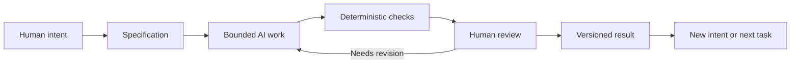

# Chapter 5: Directing Creative Work with Three Lenses

The first four chapters have followed one ordinary object: a plain white T-shirt. We used persuasion to think about attention, trust, and action. We used archetypes to think about meaning and identity. We used design language to think about how meaning becomes visible and felt.

These are not three unrelated topics. Together, they form a useful control framework for creative and technical work, including work done with AI.

## Three Questions Before Making Anything

The framework can be summarized in three questions:

| Lens | Question | Example for the white T-shirt |
| --- | --- | --- |
| Persuasion | What response are we trying to enable? | Help a careful buyer compare the shirt and decide with confidence |
| Archetype | What meaning or identity are we expressing? | The identity of a thoughtful, capable chooser |
| Design language | How should that meaning look and feel? | A restrained grid, clear hierarchy, direct photography, and readable details |

Persuasion gives the work a goal, archetype gives it a meaningful point of view, and design language gives it a recognizable form. If one lens is missing, the result can become confused. A visually striking page may have no useful action. A strong action request may feel empty or manipulative. A clear archetype may never appear in the actual experience.

The lenses also keep each other honest. Ask whether the desired response benefits the audience, whether the identity claim is supported by real behavior, and whether the visual language helps people understand rather than merely impresses them.

## Why AI Work Needs a Specification

An AI assistant can generate text, code, layouts, tests, and alternatives quickly. Speed is useful, but an open-ended request gives the system too much room to decide what success means. A specification creates a boundary.

A good specification states:

- the goal and intended audience;
- the files or parts of the system that may change;
- the required content, behavior, or format;
- constraints such as tone, accessibility, truthfulness, or available tools;
- examples of what counts as complete; and
- a check that can reveal whether the result meets the requirement.

For example, “make a compelling T-shirt page” is vague. “Create four presentations of the same imaginary white T-shirt, each with an audience, archetype, persuasion principles, visual language, headline, story, imagery direction, meaning, and ethical risk” is bounded. The second request gives an assistant room to contribute while keeping the human's purpose visible.

Boundaries are not an attempt to remove creativity. They make creative judgment easier to inspect. A student can ask, “Did this draft satisfy the assignment and serve the intended reader?” instead of judging an unlimited cloud of possible outputs.

## A Workflow with Human Control

The working sequence is:

1. **Human intent:** Decide what matters and why. Name the audience, desired response, meaning, and context.
2. **Specification:** Turn that intent into a bounded task with requirements and constraints.
3. **Bounded AI work:** Ask the assistant to produce a draft, implementation, analysis, or set of options within the boundary.
4. **Deterministic checks:** Use repeatable tests for things machines can verify cheaply, such as file existence, required headings, syntax, links, or formatting.
5. **Human review:** Inspect meaning, truthfulness, quality, context, accessibility, and fit for the actual audience.
6. **Versioned result:** Record the accepted result in Git so the work can be compared, recovered, and understood later.

The loop matters. A failed check may show that a required heading is missing. Human review may show that every heading is present but the explanation is misleading. Different problems need different forms of attention.

## What Git Adds

Git provides traceability and recovery. A commit can show what changed, when it changed, and which task or issue motivated the change. A diff makes the proposed result visible before it becomes part of a shared history. Branches allow a bounded experiment to be reviewed without disturbing the main version.

Recovery is just as important as record-keeping. AI-generated work can be useful and still contain a bad assumption, an invented detail, or an unwanted change. Version control gives the team earlier states to compare and a practical way to return to a known result. It changes “the assistant changed everything” into a series of inspectable decisions.

Git does not prove that content is true or good. It proves more modestly that a history of changes exists. Human review still has to judge the substance.

## Deterministic Checks and Probabilistic Review

Deterministic checks answer questions with repeatable rules. A script can verify that a required file exists, a Markdown heading appears, a code test passes, or a Mermaid fence is present. Given the same input and rule, the check should produce the same result. These checks are excellent for cheap, repetitive validation, but they only test what someone decided to encode.

AI review can examine tone, organization, clarity, or possible gaps. It may notice patterns that a simple script cannot. But its conclusions are probabilistic: the same request may receive different judgments, and a confident explanation may still be wrong. AI review is a useful second perspective, not a replacement for responsibility.

The strongest workflow assigns each question to the right tool:

| Question | Useful first check | Why human attention may still be needed |
| --- | --- | --- |
| Does the required file exist? | Deterministic script | Usually little interpretation is needed |
| Does the page contain a required heading or link? | Deterministic script | A present heading can still contain weak content |
| Is the explanation clear to a first-year reader? | AI review plus a human read | Clarity depends on audience and context |
| Is a claim accurate and responsibly framed? | Source checking and human judgment | A fluent draft can still mislead or omit context |
| Does the design express the intended identity? | Human review with audience feedback | Meaning is cultural and cannot be reduced to a pass/fail token |

## The Pit-Stop Moment

Imagine a race car moving through a long event. Automation can keep the process running: build files, run tests, count headings, and report obvious failures. But a race team still brings the car into the pit at selected moments. People inspect the tires, listen for unusual sounds, check the fit of the changes, and decide whether the car should continue.

Human review is that pit stop. It should not happen only after a serious failure. Choose deliberate inspection points after the specification is written, after the AI produces a significant draft, after checks pass, and before the result is shared or committed. The point is not to stare at every automated step forever. The point is to stop where judgment can change the outcome.

At the pit stop, ask:

- Does the result still serve the original intent?
- Is it truthful, specific, and appropriate for its context?
- Did the assistant make an assumption that needs correction?
- Are any people excluded, pressured, or misrepresented?
- Does the result work in practice, not only in a screenshot or explanation?
- Is this version worth keeping, revising, or rejecting?

## A Practical Checklist for AI-Assisted Work

Before starting, write the intended response, meaning, and visual or technical language in plain language. During generation, keep the task bounded to named files and requirements. After generation, run the cheapest deterministic checks available. Then read and use the work as a person in the intended audience would. Finally, review the diff and record the accepted version in Git.

For the white T-shirt case study, this might mean specifying four audience-and-meaning combinations, asking AI to draft the concepts, checking that every concept has the required fields, reviewing whether the ethical cautions are genuine, and committing the final Markdown with a message that identifies the task. The process is structured, but the final decision remains human.

## Questions for Next Week

1. Which of the three lenses is easiest for you to notice, and which one do you tend to skip?
2. What is one creative or technical task you could improve by writing a tighter specification first?
3. Which requirements can a deterministic check verify, and which require human interpretation?
4. When has a polished result seemed convincing even though its meaning or evidence was weak?
5. What should a human inspect before accepting AI-assisted work in your field?
6. How can version history make collaboration, learning, or correction easier?
7. What would responsible use of AI look like for the audience you care about?

## What You Should Remember

Persuasion asks what response we want to enable. Archetype asks what meaning or identity we are expressing. Design language asks how that meaning should look and feel. In AI-assisted work, a specification turns intent into a bounded task, deterministic checks catch repeatable problems, AI review offers a probabilistic second perspective, and Git preserves a traceable, recoverable result. Humans remain responsible for judgment, meaning, truthfulness, context, and the final decision.